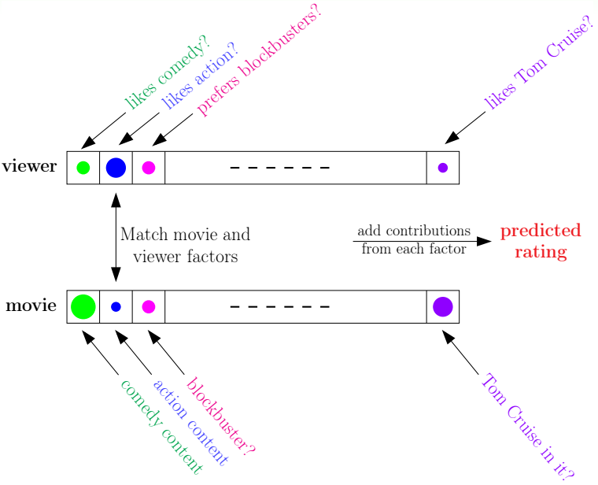

# 1.1. The Learning Problem

#### **什麼是機器學習？**

在談機器學習之前，先讓我們想一想人類到底是怎麼學習東西的？好比說，父母親教幼兒怎麼講話，幼兒可能會依呀咿呀的模仿爸媽講話的方式，當孩子慢慢越長越大後，他就越來越能把話說好。又或者是，我們在讀某本課本，我們一邊讀一邊把書上的知識用自己的腦袋想啊想，最後融會貫通變成自己的東西。諸如此類的學習歷程，不管是透過視覺、聽覺、還是嗅覺、觸覺，「學習」可以說是從**「觀察」**開始的，我們把這些觀察到的事物用自己的大腦思考、吸收、內化，最後變成一項有用的技能。這是人類學習東西的模式。

機器學習說穿了就是讓電腦去模仿人類學東西的方式：把一些資料餵給電腦，電腦就從你餵給它的資料中去學習理解關於這些資料的一切，然後獲得詮釋這些資料的能力。舉個例子來說，你可以把股票交易的歷史紀錄收集起來餵給電腦去分析，然後問它某支股票明天會漲還是跌。如果我們真能透過這種方式賺到錢，那或許我們就可以說機器從我們給它的資料中「學習」到東西了。而機器的學習表現就體現在說這樣的預測能力是否精準。

---

#### **為什麼需要機器學習？**

舉一個例子，比如說我們現在要寫一個程式來辨認樹，為了能夠做這件事，或許我們需要對樹的外觀下一些定義，這個定義要怎麼下呢？很難吧！因為有好多細節需要一一列出，然後給予定義。又比如說要寫火星探測車的程式，因為我們都沒去過火星，可能很難想像上面會有哪些物體，那些物體又大概長什樣子。從人類學習的歷程來看，我們小時候學習認樹並不是先學會了各種跟樹有關的定義，而是不斷地看過了很多顆樹，然後我們就知道了樹應該是長什麼樣子。

因此，機器學習可以派上用場的情況有： 

1. when human cannot program the system manually  
像是寫火星探測車程式，我們不知道要覽視什麼。
2. when human cannot define the solution easily  
聲音或影像的辨識，我們很難斷定要辨識的聲音波形或影像的像素分佈具體會是長什麼樣子。
3. when needing rapid decisions that human cannot do  
在短短幾秒內就需要決定股票的買賣。
4. when needing to be user-oriented in a massive scale  
像是Netflix這樣的公司，需要從大量的使用者資料中分析客戶的喜好。

所以機器學習就像是在教電腦怎麼釣魚，讓它學會自動分析資料，做出適當的決定或預測。

---

#### **什麼時候可以用機器學習?**

機器學習不是萬靈丹，通常必須具備以下三個條件才適合使用機器學習：

1. exists some underlying pattern to be learned  
存在可以學習的模式，這樣我們才有所謂的performance measure可以去加強改進。
2. but no programmable (easy) definition  
我們不知道要怎麼去定義要學習的東西，所以才要讓機器自己去學。
3. somehow there is data about the pattern  
有辦法取得跟學習有關的數據，這樣機器學習演算法才有東西好學。

---

#### **機器學習在生活上的應用**
事實上，機器學習的實務應用包山包海，遍佈日常生活中的每個領域，以下是一些例子：

1. 食 (Sadilek et al., 2013)  
餵給機器Twitter上的訊息和位置，來預測去某間餐廳吃飯會食物中毒的可能性。
2. 衣 (Abu-Mostafa, 2012)  
餵給機器衣服的銷售數據和客戶對穿搭品味的問卷調查結果，讓機器提供客戶時尚穿搭的建議。
3. 住 (Tsanas and Xifara, 2012)  
為節能減碳，讓機器學習房屋建築的資料及其耗能的數據，來預測房屋的耗能狀況。
4. 行 (Stallkamp et al., 2012)  
餵給機器交通號誌的影像和對應的意義，讓機器能準確地辨識交通號誌。
5. 育 (KDDCup 2010)  
餵給機器學生在數學教學系統上的答題記錄，來預測學生能否答對另一道題目。
6. 樂 (Netflix 2016)  
餵給機器不同使用者對不同電影的評價，來預測一個使用者對他還沒看過的電影的評價會如何。

以預測使用者對沒看過的電影的評價為例，來看看機器學習大概是怎麼運作的：

就像上圖所示，我們可以把使用者對電影的偏好特徵列出來，比如說喜不喜歡看喜劇片、喜不喜歡Tom Cruise等等，把它們安排成一個viewer向量，對某項偏好的數字越大就表示越喜歡（圖中用圓圈大小來表示數字大小）。然後對電影本身也是如此，把對應於使用者的特徵列出來弄成一個movie向量。很明顯地，我們可以把這個viewer向量和movie向量做內積，如果內積數字很大，就說明這個使用者應該會很喜歡這部電影，反之亦然。這個內積就是該使用者對此電影的rating。

在做機器學習的時候，我們會把已經收集到的rating餵給機器去學，搭配事先已有的movie向量，就能往回推估viewer向量，然後我們便能拿這個推估的viewer向量去預測使用者對還沒看過的電影的可能喜好程度。

---

#### **機器學習的具體要素：以銀行核卡為例**
假設銀行有一個新申辦信用卡的客戶資料如下，在對銀行有好處的前提之下，銀行是否應該核准這項信用卡申請呢？

| 年齡 | 23歲 |
| -- | -- |
| 性別 | 女 |
| 年薪 | NTD 1,000,000 |
| 居留時間 | 1年 |
| 年資 | 0.5年 |
| 負債 | NTD 200,000 |

我們把這問題用數學符號來加以描述：  
* 
input: $$x\in X$$  
這就是要餵給機器去學習的客戶資料，如上表。

* 
output: $$y\in Y$$  
應不應該核准此信用卡申請，這是機器學習後的答案。

* 
training data: $$D=\left\{ \left( { x }_{ 1 },{ y }_{ 1 } \right) ,\left( { x }_{ 2 },{ y }_{ 2 } \right) ,\dots ,\left( { x }_{ N },{ y }_{ N } \right)  \right\} $$  
這是要餵給機器去學習的資料。在這個例子就是銀行過往處理信用卡申請的歷史紀錄，每筆紀錄都包含了客戶資料和對應的審核結果。

* 
target function: $$f:X\rightarrow Y$$  
假設歷史資料是由某種未知的函數產生，我們想讓機器從資料中找出它。以這個例子來說就是找出是否核准發卡的準則。

* 
hypothesis: $$g:X\rightarrow Y$$  
這是機器真正從資料中學到的事情，我們預期它會盡量像f。在這邊就是機器學到的發卡準則。

也就是說，我們假設已經從未知的$$f$$得到了一些歷史資料$$D$$，然後把這些資料餵給機器學習演算法去學，機器最後會得到ㄧ個它認為近似$$f$$的hypothesis $$g$$。之後我們就拿新的資料$$x$$去問機器，機器會憑藉著它所知道的$$g$$來給我們答案$$y$$。