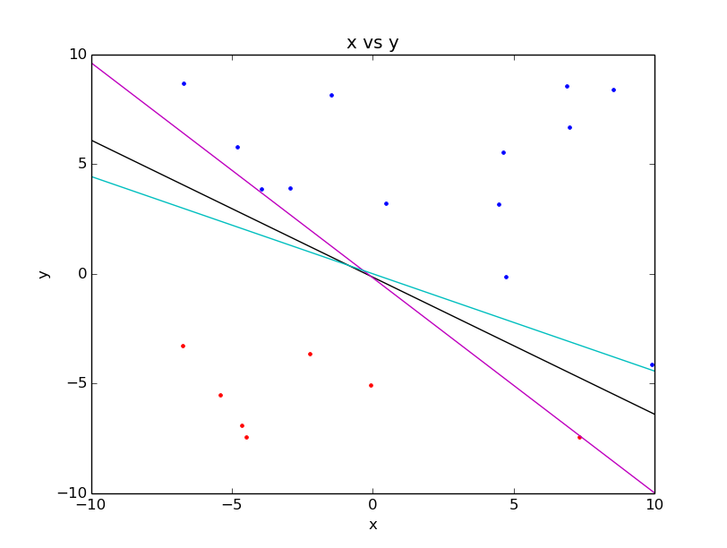

# Linear Support Vector Machine

###1. [PLA](https://github.com/frank770504/PLA) (複習)
 - 假設在二維平面上有兩群點，PLA算出來的結果會是一條分割兩群資料的直線。
 - 因為PLA具有隨機性，所以每次求出來的可能不會是同一條。
 - 假設在這個假說集（Hypothesis set）中有一條最好的線，哪一條線是最好的呢？

###2. 最好的線
 - 
  - 圖中有三種顏色的線，都可以分開這兩群資料，我們必須找出最好的那條線
  - 紅色和淺藍色的線都有地方很靠近資料點，有一種一不小心就會越界的感覺
  - 黑色的線是看起來是最好的，因為他離兩群資料都很開
 - 依直覺來看，我們會認為有一條線（或是多維平面），在兩群資料之間擁有最大的邊界，這條線就會是最好的那條。
   - 以取樣的角度來看，我們的訓練資料（training data）是真實資料的一部分。假設在取樣過程中會有一定程度的誤差，最大邊界的線相對起來比較可以容忍誤差。
   - 以 overfitting 的角度來看。機器學習其實就是一個最佳化過程，在最佳化的時候，如果增加一些條件，我們可以把這些條件看成 [正規化(regulization)](https://en.wikipedia.org/wiki/Regularization_%28mathematics%29)，這些條件就可以減少我們對於資料 overfitting 的產生。

###3. 來找邊界最大的線吧！
 - 這是一個最佳化問題的描述，『**在所有的分界線中**，**找到一條邊界最大的**』
 - 通常我們會用 margin 來稱呼邊界，並定義它為所有資料點到此分界線中最短的距離
  - $$margin(\mathbf{w}) = \underset{n=1,...,N}{min}\; dist(\mathbf{x}_n,\mathbf{w})$$
  - 其中$$\mathbf{w}$$指的是多維平面的係數，舉例：如果是d維平面的話$$\mathbf{w}=\left \[w_d\; w_{d-1}\;  ...\;  w_1\;  w_0 \right \]^T$$，這邊有多一個$$w_0$$，
  - 這邊
 - 我們可以利用上面 margin 的定義來完成這個最佳化問題的表示式
---
  - $$\underset{\mathbf{w}}{max}\; margin(\mathbf{w})$$ --> **找到一條邊界最大的**
  - $$s.t.\; \mathbf{w}\, 可以將所有\; (\mathbf{w}_n,y_n)\; 正確分類$$ --> **在所有的分界線中**
---
 - 這是一個語意化的式子，那我們接下來的目標就是把這些式子轉化成，『數學』的形式

####3.1. 轉化 『$$s.t.\; \mathbf{w}\, 可以將所有\; (\mathbf{w}_n,y_n)\; 正確分類$$』
 - 正確分類的意義是把所有的$$\mathbf{x}_n$$帶入分類線後所得到的結果會跟一樣$$y_n$$
 - 如果以PLA當作例子的話，就會變成 $$sign(\mathbf{w}^{T}\mathbf{x}_n)=y_n$$，也就是兩邊算出來的值要是同號的意思（註：$$y_n=\left \{-1,+1\right \}$$）
 - 如果目的是找同號的話，把它看成相乘大於零即可，式子就可以寫成 $$\forall \mathbf{w}^{T}{\mathbf{x}_n}y_n>0$$
---
 - $$\underset{\mathbf{w}}{max}\; margin(\mathbf{w})$$
 - $$\forall \mathbf{w}^{T}{\mathbf{x}_n}y_n>0$$
---
####3.2. 轉化 『$$margin(\mathbf{w})$$』
 - 前面說過margin是點到線（平面）的最短距離，$$margin(\mathbf{w}) = \underset{n=1,...,N}{min}\; dist(\mathbf{x}_n,\mathbf{w})$$，那$$dist(\mathbf{x}_n,\mathbf{w}$$的定義是什麼呢？
 - 一般來說如果不知道定義的話，我們可以從網路上找答案，比如說[wiki](https://en.wikipedia.org/wiki/Distance_from_a_point_to_a_plane)
  - 概念很簡單，我們先找到平面的法向量，
